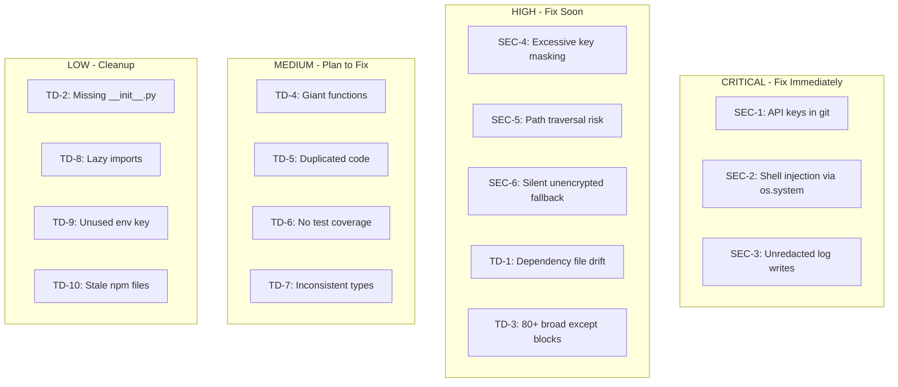

# Security Vulnerabilities and Technical Debt Audit

## CRITICAL - Security Vulnerabilities

### SEC-1: API Keys Committed to Git Repository
[.env](.env) L2-L3 contains **real API keys** in plaintext:
```
OPENROUTER_API_KEY=sk-or-v1-93cbfeb...
NINE_ROUTER_API_KEY=sk-920f9e9e...
```
[.gitignore](.gitignore) does **NOT** list `.env` — the file is tracked in version control.

**Fix:** Add `.env` to `.gitignore`, remove from git history (`git rm --cached .env`), **rotate both keys immediately**.

---

### SEC-2: Shell Injection via `os.system()` with Unsanitized Input
[core/cli/context_flow.py](core/cli/context_flow.py) L139, L233:
```python
os.system(f'{editor} "{context_path}"')
```
`EDITOR` env var is user-controlled. A malicious value like `rm -rf / ;` would execute arbitrary commands. Same pattern in:
- [core/cli/workflow/list_view.py](core/cli/workflow/list_view.py) L55
- [core/cli/workflow/monitor.py](core/cli/workflow/monitor.py) L467

**Fix:** Replace with `subprocess.run([editor, str(path)])` — no shell interpolation.

---

### SEC-3: Sensitive Data Written to Logs Without Redaction
[core/cli/state.py](core/cli/state.py) L73-79 — `log_system_action()` writes raw `detail` to `~/.ai-team/actions.log` with **zero redaction**. Call sites pass user prompts verbatim:
- [core/cli/ask_flow.py](core/cli/ask_flow.py) L279: `log_system_action("ask.request", prompt[:200])`
- [core/cli/start_flow.py](core/cli/start_flow.py) L70: `log_system_action("start.enter", (prompt or "")[:200])`
- [core/cli/workflow/monitor.py](core/cli/workflow/monitor.py) L695: `log_system_action("monitor.input", raw[:300])`

The `redact_for_display()` in [utils/env_guard.py](utils/env_guard.py) exists but is **never called** in `log_system_action`.

**Fix:** Apply `redact_for_display(detail)` inside `log_system_action` before writing.

---

### SEC-4: API Key Mask Leaks Prefix and Suffix
[core/config/settings.py](core/config/settings.py) L32-36:
```python
def mask_api_key() -> str:
    key = os.getenv("OPENROUTER_API_KEY", "")
    if len(key) <= 8:
        return "****"
    return f"{key[:8]}...{key[-4:]}"
```
Exposing 12 characters (first 8 + last 4) is excessive for a 64-char key. Screenshots or shared logs can leak enough to narrow key space.

**Fix:** Show only last 4 characters: `f"sk-or-***...{key[-4:]}"`.

---

### SEC-5: Path Traversal in `read_project_file`
[agents/base_agent.py](agents/base_agent.py) L498-523 — `file_name` is joined to fixed roots without sanitization. If an agent ever passes `../../etc/passwd`, it resolves outside intended directories.

**Fix:** Add `Path(file_name).resolve()` check ensuring result stays under allowed roots.

---

### SEC-6: Vault Key Fallback to Unencrypted Storage
[core/storage/knowledge_store.py](core/storage/knowledge_store.py) L31-35:
```python
def _vault_wrap(compressed: bytes) -> bytes:
    f = _vault_fernet_optional()
    if f is None:
        return compressed  # silently stores unencrypted
```
If `AI_TEAM_VAULT_KEY` is missing, data is stored **unencrypted** with no warning to the user.

---

## HIGH - Technical Debt

### TD-1: Triple Dependency File Drift
Three packaging files with **divergent** dependency lists:

| File | Deps listed |
|------|------------|
| [pyproject.toml](pyproject.toml) | rich, openai, python-dotenv, pydantic, click, prompt_toolkit, langgraph, langgraph-checkpoint-sqlite, textual, cryptography |
| [requirements.txt](requirements.txt) | rich, click, requests, fpdf2 |
| [setup.py](setup.py) | rich, openai, python-dotenv, pydantic, click, prompt_toolkit, psutil |

`setup.py` also declares `py_modules=['cli', 'config']` and `packages=find_packages(include=['agents', 'agents.*'])` — missing `core/`, `utils/` entirely.

**Fix:** Delete `setup.py` and `requirements.txt`; keep `pyproject.toml` as single source of truth.

---

### TD-2: Missing `__init__.py` in `agents/teamMap/`
[agents/teamMap/](agents/teamMap/) has only `_team_map.py` with no `__init__.py`, breaking standard Python package conventions.

---

### TD-3: Broad `except Exception` Everywhere (~80+ occurrences)
Swallows all errors silently across the entire codebase. Most egregious cases use `except Exception: pass` with no logging:
- [core/cli/state.py](core/cli/state.py) L35, L44, L78, L94, L132
- [utils/tracker.py](utils/tracker.py) L52, L114, L123, L134, L137
- [core/cli/context_flow.py](core/cli/context_flow.py) L34, L71, L82, L150, L248, L257, L274

---

### TD-4: Massive Functions (>100 lines)
| Function | File | Lines |
|----------|------|-------|
| `run_start` | [core/cli/start_flow.py](core/cli/start_flow.py) | ~187 lines |
| `call_api` | [agents/base_agent.py](agents/base_agent.py) | ~178 lines |
| `run_agent_graph` | [core/cli/workflow/runner.py](core/cli/workflow/runner.py) | ~165 lines |
| `show_role_detail` | [core/cli/change_flow.py](core/cli/change_flow.py) | ~150 lines |
| `run_ask_mode` | [core/cli/ask_flow.py](core/cli/ask_flow.py) | ~128 lines |
| `show_context` | [core/cli/context_flow.py](core/cli/context_flow.py) | ~115 lines |
| `call_api_stream` | [agents/base_agent.py](agents/base_agent.py) | ~110 lines |

---

### TD-5: Duplicated Code
- Color constants duplicated between [core/dashboard.py](core/dashboard.py) and [core/cli/ui.py](core/cli/ui.py)
- `show_context` repeated "read file, split, truncate, Panel" block (L204-211 vs L236-241 in [core/cli/context_flow.py](core/cli/context_flow.py))
- `sys.path` manipulation duplicated in [core/cli/app.py](core/cli/app.py) L31-33 and [agents/ambassador.py](agents/ambassador.py) L16-18
- `clear_workflow_activity_log` imported twice in [core/cli/app.py](core/cli/app.py)

---

### TD-6: Almost Zero Test Coverage
Only [test_leader_flow.py](test_leader_flow.py) exists — a single manual test file. No `tests/` directory, no pytest config, no CI. 56 modules are completely untested.

---

### TD-7: Inconsistent Type Hints
- Mix of `Dict`/`List` (typing module) vs `dict`/`list` (builtins) across files
- Many public functions lack return type annotations (30+ in [core/cli/app.py](core/cli/app.py) alone)
- Broad `Callable[..., None]` instead of specific signatures

---

### TD-8: Pervasive Lazy Imports Inside Functions
100+ function-level imports scattered across the codebase (agents, core/cli, utils) instead of top-level imports. While sometimes intentional for circular dependency avoidance, the scale indicates architectural coupling issues.

---

### TD-9: Unused `.env` Key
`NINE_ROUTER_API_KEY` exists in `.env` but **no code references it**. Either dead config or missing integration.

---

### TD-10: Empty/Stale npm Files
[package.json](package.json) contains `{}` and [package-lock.json](package-lock.json) exists — no Node.js code in the project. These are noise.

---

## Summary by Priority


